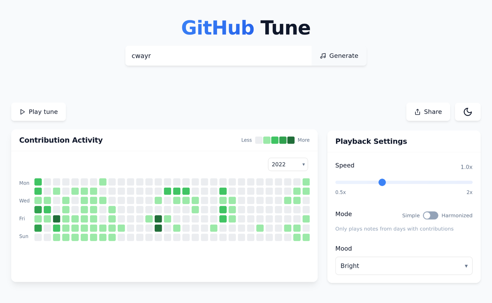

# GitHub Tune

**Turn your GitHub contribution graph into a musical melody.**

GitHub Tune transforms your contribution history into music, creating a unique melody that represents your coding journey. Each contribution level generates a different note, bringing your GitHub activity to life through sound.

## Demo

1. Change your GitHub Profile URL `github.com/username` to **`githubtune.com/username`**.
2. Press **Play** to hear your coding activity as music, adjust the scales and moods for variety!

## Project Structure

The project is organized into three main directories:

### `/frontend`

SvelteKit application that provides the user interface and audio generation.

- **Key Files**:
  - `src/routes/+page.svelte`: Main application page
  - `src/components/ContributionGraph.svelte`: GitHub-style contribution visualization
  - `src/lib/audio-engine.ts`: Tone.js integration for musical generation

### `/backend`

Serverless functions that fetch and process GitHub contribution data.

- **Key Files**:
  - `functions/contributionFetcher/index.ts`: Main Lambda handler
  - `functions/contributionFetcher/parseContributions.ts`: HTML parsing logic

### `/infrastructure`

AWS CDK code for provisioning and managing cloud infrastructure.

- **Key Files**:
  - `lib/infrastructure-stack.ts`: Defines AWS resources and architecture

## How It Works

1. **Data Fetching**: The backend scrapes GitHub's contribution graph HTML
2. **Data Processing**: Contribution levels (0-4) are extracted from the HTML
3. **Visualization**: The frontend renders a contribution graph matching GitHub's style
4. **Sonification**: Contribution levels are mapped to musical notes:
   - Level 0 (no contributions): Silent
   - Level 1-4: Increasingly higher notes on the selected scale
5. **Playback**: Notes are played sequentially, week by week, day by day
6. **Harmonization**: Optional harmonies can be added based on the melody

## Technologies

- **Frontend**:
  - [SvelteKit](https://kit.svelte.dev/) - Web framework
  - [Tone.js](https://tonejs.github.io/) - Audio synthesis
  - [TailwindCSS](https://tailwindcss.com/) - Styling
  - [TypeScript](https://www.typescriptlang.org/) - Type safety

- **Backend**:
  - [AWS Lambda](https://aws.amazon.com/lambda/) - Serverless functions
  - [Cheerio](https://cheerio.js.org/) - HTML parsing
  - [TypeScript](https://www.typescriptlang.org/) - Type safety

- **Infrastructure**:
  - [AWS CDK](https://aws.amazon.com/cdk/) - Infrastructure as code
  - [CloudFront](https://aws.amazon.com/cloudfront/) - Content delivery
  - [API Gateway](https://aws.amazon.com/api-gateway/) - API management
  - [S3](https://aws.amazon.com/s3/) - Static hosting

## Contributing

Contributions are welcome! Please feel free to submit a Pull Request.

See the individual README files in each directory for component-specific contribution guidelines.

## License

This project is licensed under the MIT License - see the LICENSE file for details.

## Acknowledgements

- [GitHub](https://github.com/) for the inspiration and contribution graph
- [Tone.js](https://tonejs.github.io/) for the fantastic audio library
- [Salamander Grand Piano](https://github.com/sfzinstruments/SalamanderGrandPiano) for equally fantastic piano samples
