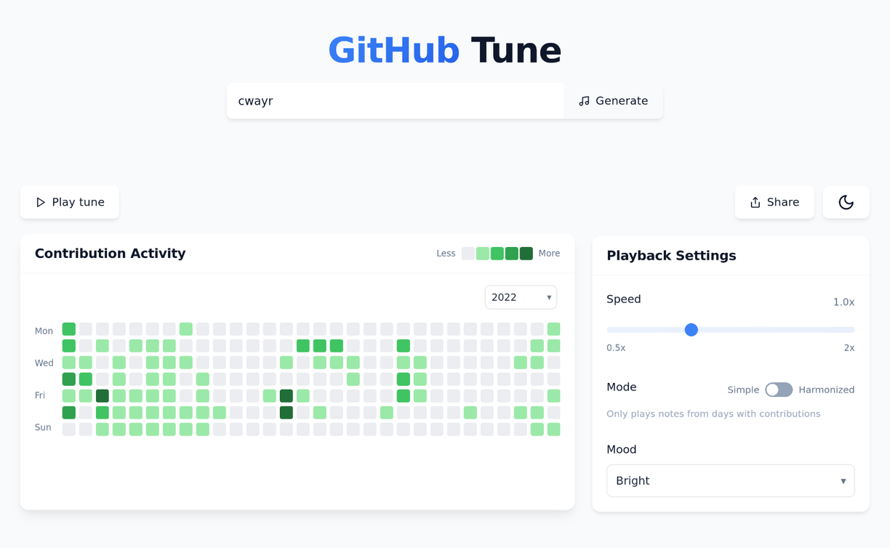

# GitHub Tune

**Turn your GitHub contribution graph into a musical melody.**

GitHub Tune transforms your contribution history into music, creating a unique melody that represents your coding journey. Each contribution level generates a different note, bringing your GitHub activity to life through sound.

## 🎵 Try It Out

Visit **[githubtune.com/username](https://githubtune.com)** (replace `username` with any GitHub username) to:

1. View your GitHub contribution graph
2. Press **Play** to hear your coding activity as music
3. Adjust scales, moods, and playback speed for variety

**Example**: [githubtune.com/torvalds](https://githubtune.com/torvalds)



## 🚀 Getting Started

### Prerequisites

Before setting up the project locally, ensure you have:

- **[Node.js](https://nodejs.org/)** v18 or higher
- **[pnpm](https://pnpm.io/)** package manager
- **[AWS CLI](https://aws.amazon.com/cli/)** (for infrastructure deployment only)
- **AWS Account** with appropriate permissions (for deployment only)

### Local Development

To run the frontend application locally:

```bash
# Navigate to the frontend directory
cd frontend

# Install dependencies
pnpm install

# Start the development server
pnpm run dev
```

The application will be available at `http://localhost:5173` (or another port if 5173 is in use).

**Note**: The local frontend will connect to the production backend API by default. To develop with the backend locally, see [backend/README.md](backend/README.md).

### Building for Production

Each component can be built independently:

```bash
# Build frontend
cd frontend && pnpm run build

# Build backend
cd backend && pnpm run build

# Build infrastructure
cd infrastructure && pnpm run build
```

For complete deployment instructions, see [infrastructure/README.md](infrastructure/README.md).

## 🏗️ Project Structure

The project is organized into three main directories:

### `/frontend`

**SvelteKit application** that provides the user interface and audio generation.

- **Key Files**:
  - `src/routes/+page.svelte`: Main application page
  - `src/components/ContributionGraph.svelte`: GitHub-style contribution visualization
  - `src/lib/audio-engine.ts`: Tone.js integration for musical generation
- **See [frontend/README.md](frontend/README.md)** for detailed setup and development instructions

### `/backend`

**Serverless functions** that fetch and process GitHub contribution data.

- **Key Files**:
  - `functions/contributionFetcher/index.ts`: Main Lambda handler
  - `functions/contributionFetcher/parseContributions.ts`: HTML parsing logic
- **See [backend/README.md](backend/README.md)** for API documentation and deployment details

### `/infrastructure`

**AWS CDK code** for provisioning and managing cloud infrastructure.

- **Key Files**:
  - `lib/infrastructure-stack.ts`: Defines AWS resources and architecture
- **See [infrastructure/README.md](infrastructure/README.md)** for deployment instructions

## 🎼 How It Works

The application transforms your GitHub contribution history into music through a multi-step process:

1. **Data Fetching**: The backend Lambda function scrapes GitHub's contribution graph HTML
2. **Data Processing**: Contribution levels (0-4) are extracted and structured from the HTML
3. **Visualization**: The frontend renders an interactive contribution graph matching GitHub's style
4. **Sonification**: Each contribution level is mapped to musical notes:
   - **Level 0** (no contributions): Silent
   - **Levels 1-4**: Progressively higher notes on your selected musical scale
5. **Playback**: Notes are played sequentially, week by week, day by day, creating your coding melody
6. **Harmonization**: Optional harmonies add depth based on the melody's notes

## 🔧 Technologies

- **Frontend**:
  - [SvelteKit](https://kit.svelte.dev/) - Web framework
  - [Tone.js](https://tonejs.github.io/) - Audio synthesis
  - [TailwindCSS](https://tailwindcss.com/) - Styling
  - [TypeScript](https://www.typescriptlang.org/) - Type safety

- **Backend**:
  - [AWS Lambda](https://aws.amazon.com/lambda/) - Serverless functions
  - [Cheerio](https://cheerio.js.org/) - HTML parsing
  - [TypeScript](https://www.typescriptlang.org/) - Type safety

- **Infrastructure**:
  - [AWS CDK](https://aws.amazon.com/cdk/) - Infrastructure as code
  - [CloudFront](https://aws.amazon.com/cloudfront/) - Content delivery
  - [API Gateway](https://aws.amazon.com/api-gateway/) - API management
  - [S3](https://aws.amazon.com/s3/) - Static hosting

## 📐 Architecture

```
┌─────────────┐
│   Browser   │
└──────┬──────┘
       │
       │ HTTPS
       │
┌──────▼──────────────────────────────────────┐
│          CloudFront CDN                      │
│  ┌────────────────┐   ┌──────────────────┐ │
│  │  Static Files  │   │   API Routes     │ │
│  │  (S3 Bucket)   │   │  (/api/*)        │ │
│  └────────────────┘   └────────┬─────────┘ │
└───────────────────────────────┼─────────────┘
                                │
                        ┌───────▼──────────┐
                        │   API Gateway    │
                        └───────┬──────────┘
                                │
                        ┌───────▼──────────┐
                        │  Lambda Function │
                        │ (Contribution    │
                        │   Fetcher)       │
                        └───────┬──────────┘
                                │
                                │ HTTPS
                        ┌───────▼──────────┐
                        │     GitHub       │
                        │  (HTML Scraping) │
                        └──────────────────┘
```

**Request Flow:**
1. User visits `githubtune.com/username`
2. CloudFront serves static frontend from S3
3. Frontend requests contribution data via `/api/username`
4. API Gateway triggers Lambda function
5. Lambda scrapes GitHub's contribution graph
6. Processed data returns to frontend
7. Frontend visualizes and sonifies the data

## 🤝 Contributing

Contributions are welcome! Here's how to get started:

1. **Fork the repository** and clone it locally
2. **Create a new branch** for your feature: `git checkout -b feature/your-feature-name`
3. **Make your changes** following the existing code style
4. **Test your changes** thoroughly in all affected components
5. **Commit your changes**: `git commit -m "Add your feature description"`
6. **Push to your fork**: `git push origin feature/your-feature-name`
7. **Open a Pull Request** with a clear description of your changes

### Development Guidelines

- Maintain TypeScript type safety throughout
- Follow the existing code organization and patterns
- Keep components small and focused
- Write clear commit messages
- Update documentation for any API or UI changes

## 🐛 Troubleshooting

### Common Issues

**Audio doesn't play:**
- Ensure your browser allows audio playback (some browsers require user interaction first)
- Check browser console for Tone.js errors
- Try a different browser (Chrome, Firefox, or Safari recommended)

**GitHub user not found:**
- Verify the username is correct and the profile is public
- Some new GitHub accounts may not have contribution data yet

**Application won't start locally:**
```bash
# Clear dependencies and reinstall
cd frontend
rm -rf node_modules pnpm-lock.yaml
pnpm install
```

**Build failures:**
- Ensure you're using Node.js v18 or higher: `node --version`
- Check that pnpm is installed: `pnpm --version`
- Try clearing the build cache: `rm -rf .svelte-kit/` (in frontend)

For more specific issues, please check the individual README files in each component directory or [open an issue](https://github.com/cwayr/github-tune/issues).

## 📄 License

This project is open source and available for personal and educational use.

## 🙏 Acknowledgements

- [GitHub](https://github.com/) for the inspiration and contribution graph
- [Tone.js](https://tonejs.github.io/) for the fantastic audio library
- [Salamander Grand Piano](https://github.com/sfzinstruments/SalamanderGrandPiano) for equally fantastic piano samples
